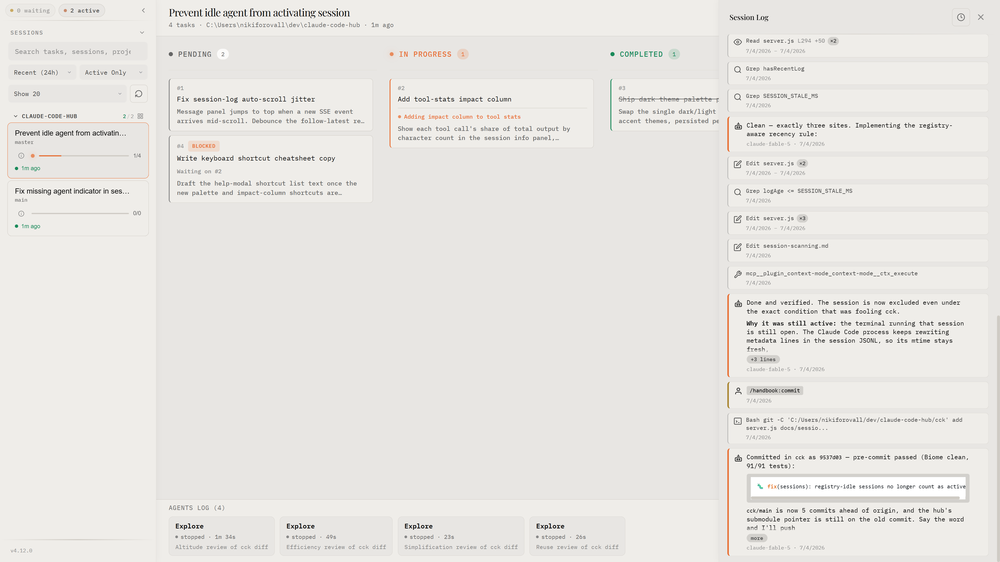
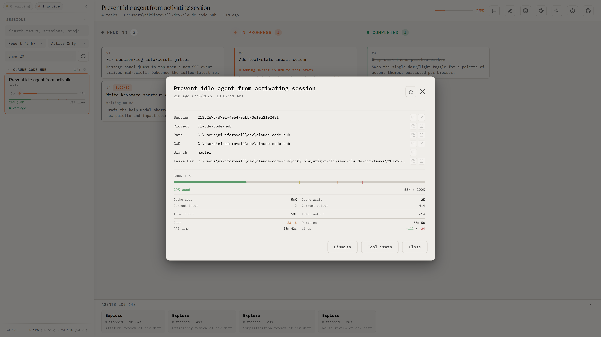
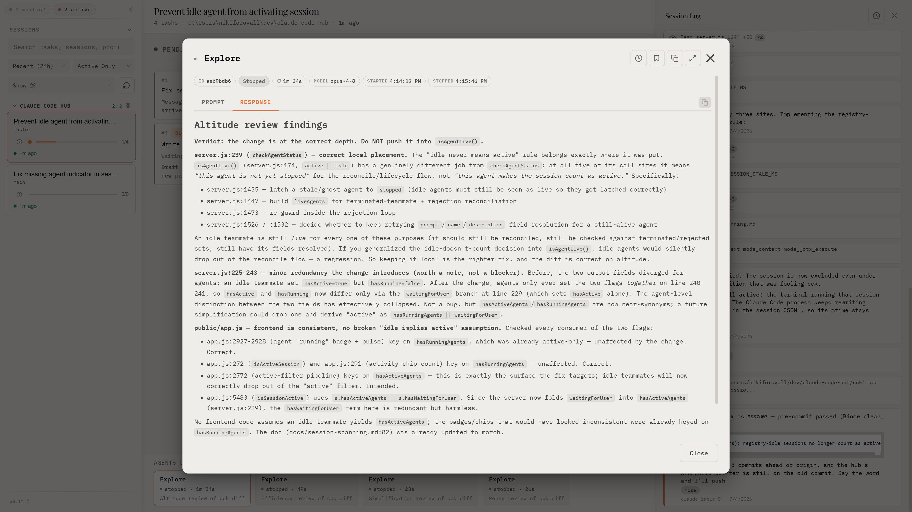
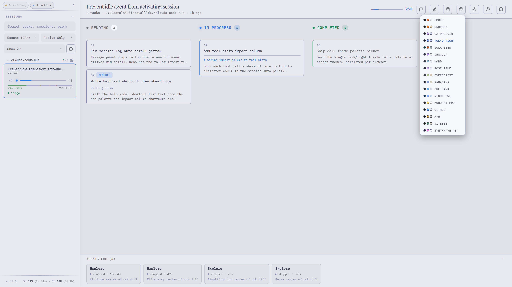

# Claude Code Kanban

[](https://www.npmjs.com/package/claude-code-kanban)
[](LICENSE)
[](https://www.npmjs.com/package/claude-code-kanban)

**[Live Demo & Docs](https://nikiforovall.blog/claude-code-kanban/)**

> Watch Claude Code work, in real time.



## Getting Started

### 1. Install hooks (one-time setup)

Hooks enable subagent tracking, waiting-for-user detection, and session activity indicators. **Without hooks, you only see tasks — no agent log, no live indicators.**

```bash
npx claude-code-kanban --install
```

Non-destructive — existing settings in `~/.claude/settings.json` are preserved. Uninstall anytime with `npx claude-code-kanban --uninstall`.

### 2. Start the dashboard

```bash
npx claude-code-kanban --open
```

### 3. Use Claude Code as usual

Tasks, agents, and messages appear on the board automatically — Claude Code writes task files and conversation logs to `~/.claude`, the dashboard watches them and streams updates to the browser via SSE. It never directs Claude's work.

## Features

- **Real-time Kanban board** — Tasks move through Pending → In Progress → Completed as Claude works
- **Session log** — The full conversation timeline: prompts, replies, tool calls and results (`Shift+L`)
- **Agent log** — Live subagent tracking with prompts, duration, status, and idle detection
- **Task detail panel** — Full description, notes, blockedBy/blocks dependencies, inline editing
- **Follow & pin** — Follow the latest message live (`Shift+M`), pin the messages that matter
- **Tool stats & impact** — Per-session tool usage breakdown and file impact
- **Waiting-for-user indicators** — Amber highlight on sessions needing permission or input
- **Agent teams** — Color-coded team members, owner filtering, member count badges
- **17 color themes** — Dracula, Nord, Catppuccin, Gruvbox, Tokyo Night, and more — each in light and dark
- **Storage manager** — Inspect disk usage and clean up stale sessions and tasks
- **Keyboard-first** — Press `?` for the full shortcut reference








## Context Window Monitoring

Per-session context usage bars, token/cost breakdowns, and model info in the sidebar and detail panel. The installer copies `context-status.sh` — wire it into your statusline in `~/.claude/settings.json`:

```json
{
  "statusLine": {
    "type": "command",
    "command": "~/.claude/hooks/context-status.sh | npx -y ccstatusline@latest",
    "padding": 0
  }
}
```

The script pipes through, so your existing statusline keeps working.

## Configuration

```bash
PORT=8080 npx claude-code-kanban             # Custom port (falls back if busy)
npx claude-code-kanban --open                # Auto-open browser
npx claude-code-kanban --dir=~/.claude-work  # Custom Claude config dir
```

Global install: `npm install -g claude-code-kanban`, then `claude-code-kanban --open`.

## License

MIT
