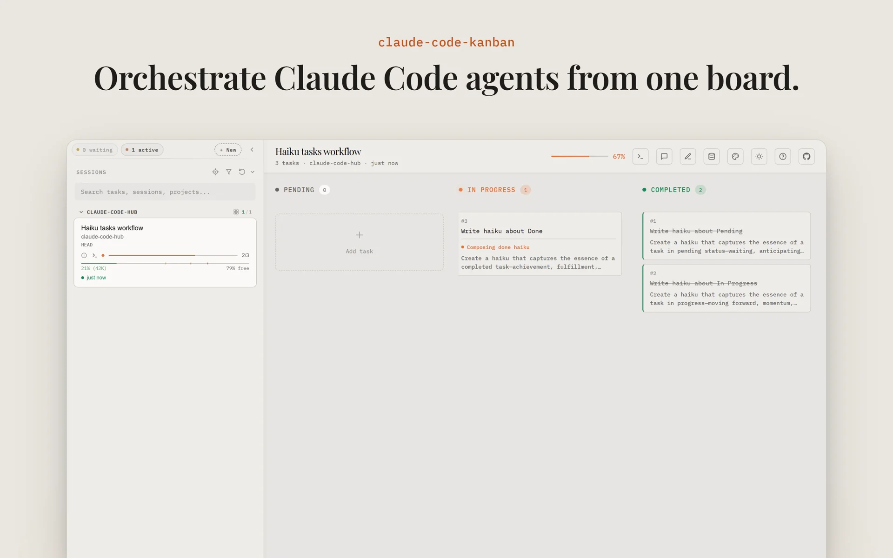
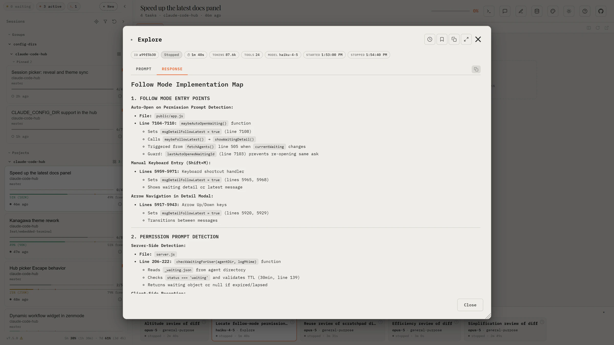
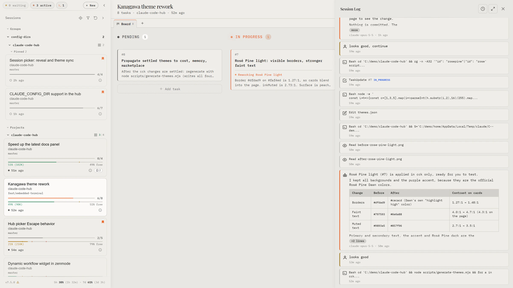
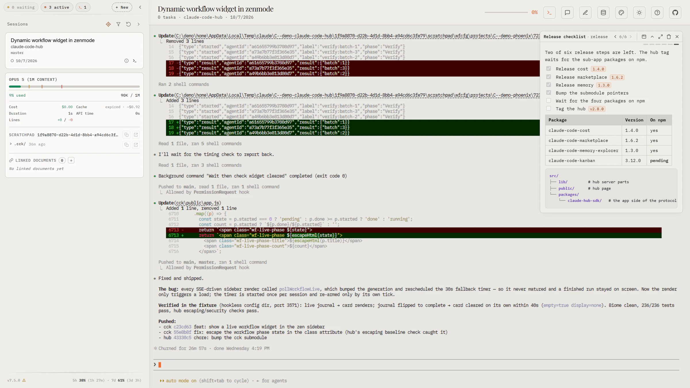

# Claude Code Kanban

[](https://www.npmjs.com/package/claude-code-kanban)
[](LICENSE)
[](https://www.npmjs.com/package/claude-code-kanban)

Start, watch and answer Claude Code sessions from one live board, with a terminal built in.

**[Documentation](https://nikiforovall.blog/claude-code-kanban/)**

<a href="https://youtu.be/QbvDBFyfC7s">
  <picture>
    <source media="(prefers-color-scheme: dark)" srcset="website/public/video/cck-dark.webp">
    
  </picture>
</a>

Watch the tour on YouTube: [light](https://youtu.be/QbvDBFyfC7s), [dark](https://youtu.be/bXZ4_QCmD7k).

## Getting started

You need Node.js 20 or later and the `claude` CLI.

### 1. Install the integration (one time)

```bash
npx claude-code-kanban --install
```

The installer adds a Claude Code plugin with hooks, skills and a mod for context use and cost (Claude Code 2.1.287 or later). It asks before it installs and keeps your other settings. Without the hooks, the board shows tasks only: no agent log, no live activity, no waiting prompts.

To remove it, run `npx claude-code-kanban --uninstall`. For another Claude config dir, pass the same `--dir=<path>` (or set `CLAUDE_CONFIG_DIR`) to `--install`, `--uninstall` and the server. See [Getting started](https://nikiforovall.blog/claude-code-kanban/getting-started/) for each install step.

### 2. Start the board

```bash
npx claude-code-kanban --open
```

The board runs at `http://localhost:3541`. To install the command globally, run `npm install -g claude-code-kanban`, then `claude-code-kanban --open`.

### 3. Use Claude Code as usual

Run `claude` in any project. You do not configure anything per project. Claude Code writes task files and transcripts to the config dir, and the board watches them and sends each change to the browser.

> **Empty board?** Claude Code ships the task tools off by default on some models, so Claude writes no tasks. Turn them on in the `env` block of Claude Code `settings.json`, then restart Claude Code:
>
> ```json
> { "env": { "CLAUDE_CODE_ENABLE_TODO_TOOLS": "true" } }
> ```
>
> You can also add a task by hand with **Add task** in the Pending column.

## Features

### Watch

- **Live board.** Tasks move through Pending, In Progress and Completed as Claude works. The task panel shows what a task waits on and what it blocks, and you can edit the title and description in place. [Sessions and the board](https://nikiforovall.blog/claude-code-kanban/guides/sessions-and-board/)
- **Session log.** Every prompt, reply and tool call in order (<kbd>Shift</kbd>+<kbd>L</kbd>). Follow the newest message with <kbd>Shift</kbd>+<kbd>M</kbd>, and pin the messages that matter. [Session log and details](https://nikiforovall.blog/claude-code-kanban/guides/session-details/)
- **Subagents.** The agents log lists each subagent with its model, status and run time. Open one to read its prompt and response. Team sessions get colored owner badges and an owner filter. [Subagents](https://nikiforovall.blog/claude-code-kanban/guides/subagents/)
- **Session info and tool stats.** Model, branch, context window use, cost, and which tools ran. The sidebar footer shows your 5-hour and 7-day rate limit use.
- **Zen mode.** <kbd>Ctrl</kbd>+<kbd>Shift</kbd>+<kbd>Z</kbd> shows only the current session in the sidebar, with its context use, scratchpad folder and linked documents.

<picture>
  <source media="(prefers-color-scheme: dark)" srcset="website/public/shots/themes/ember-02-subagent-preview-dark.webp">
  
</picture>

### Drive

- **Answer prompts from the board.** When Claude asks for permission, asks a question or waits for plan approval, the session gets an amber highlight and the ask shows with Allow and Deny buttons or an answer form. The terminal prompt stays open, and the first answer wins. [Answer prompts from the board](https://nikiforovall.blog/claude-code-kanban/guides/waiting-prompts/)
- **Embedded terminal.** Run a real Claude Code process for any session next to its board (<kbd>Ctrl</kbd>+<kbd>&#96;</kbd>). <kbd>Ctrl</kbd>+<kbd>Alt</kbd>+<kbd>R</kbd> resumes a past session and <kbd>Ctrl</kbd>+<kbd>Alt</kbd>+<kbd>S</kbd> swaps to the previous one. The terminal is off by default when the board runs alone. Start it with `--enable-terminal` and open the `#t=<token>` link the server prints. [Embedded terminal](https://nikiforovall.blog/claude-code-kanban/guides/embedded-terminal/)
- **New session.** <kbd>Ctrl</kbd>+<kbd>Alt</kbd>+<kbd>N</kbd> opens a dialog to pick a folder, a name, a model, an optional git worktree and a first prompt. Needs the terminal.
- **Dispatch.** Hand a written task to a new session with `claude-code-kanban dispatch start`, or ask Claude to do it with the `dispatch` skill. Add `--report` to get the outcome back. Needs the terminal. [Dispatch tasks to other sessions](https://nikiforovall.blog/claude-code-kanban/guides/dispatch/)
- **Steer with card moves.** Run `/claude-code-kanban:follow` in a session, then drag its cards. Claude starts, parks or stops the task. [Claude Code plugin skills](https://nikiforovall.blog/claude-code-kanban/guides/plugin-skills/)
- **Review comments.** Select text in a previewed file or the plan, add comments and send them to the session in one step. [Review comments](https://nikiforovall.blog/claude-code-kanban/guides/review-comments/)

<picture>
  <source media="(prefers-color-scheme: dark)" srcset="website/public/shots/themes/ember-11-waiting-prompt-dark.webp">
  
</picture>

<picture>
  <source media="(prefers-color-scheme: dark)" srcset="website/public/shots/themes/ember-terminal-dark.webp">
  
</picture>

### Organize

- **Session groups.** Drag sessions and projects from different folders into one named group in the sidebar. [Session groups](https://nikiforovall.blog/claude-code-kanban/guides/session-groups/)
- **Filters, search and pins.** Filter by project and activity, search across sessions and tasks, pin a session or make it sticky. <kbd>Shift</kbd>+<kbd>P</kbd> opens the session picker.
- **Scratchpad and linked documents.** Keep a note per session, project or group (<kbd>N</kbd>), and link files or web URLs to a session to open them in one click.
- **Themes.** 17 color themes, each in light and dark. <kbd>T</kbd> switches the mode.
- **Keyboard first.** Arrow keys move through tasks, and <kbd>Tab</kbd> moves between the sidebar and the board. Press <kbd>?</kbd> for the full list. [Keyboard shortcuts](https://nikiforovall.blog/claude-code-kanban/reference/keyboard-shortcuts/)

## CLI

With no subcommand, `claude-code-kanban` starts the server. Subcommands talk to a server that already runs:

- `session list|search|open|view|plan|agents|pin|pins|peek` to read and focus sessions.
- `task list` and `project list` to read tasks and projects.
- `preview-doc` and `link-doc` to show or link a file on the board.
- `dispatch start|done|wait|list` to start sessions with a task and collect their reports.

Run `claude-code-kanban --help` or see the [CLI reference](https://nikiforovall.blog/claude-code-kanban/reference/cli/).

## Configuration

```bash
PORT=8080 npx claude-code-kanban               # Custom port. If it is busy, the server uses a random free port.
npx claude-code-kanban --dir=~/.claude-work    # Another Claude config dir (or CLAUDE_CONFIG_DIR)
npx claude-code-kanban --enable-terminal       # Turn on the embedded terminal
EDITOR="code -w" npx claude-code-kanban        # Command for Open in editor (default: code)
```

- The server listens on `127.0.0.1` only and has no authentication. To reach it from another machine, use `--host` and `--allowed-hosts`, and do it only on a network you trust.
- UI approvals are on by default. Turn them off or tune them in `<config-dir>/.cck/config.json`.
- Terminal settings, such as the shell, font size and scrollback, go in the `CCK_TERMINAL` JSON variable.

See [Configuration](https://nikiforovall.blog/claude-code-kanban/reference/configuration/) for every setting, and [Troubleshooting](https://nikiforovall.blog/claude-code-kanban/troubleshooting/) for common problems.

Claude Code Kanban also runs as a tab in [Claude Code Hub](https://nikiforovall.blog/claude-code-kanban/guides/claude-code-hub/), where the terminal is on by default.

## License

MIT
